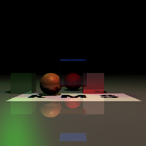
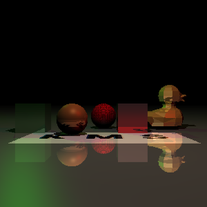
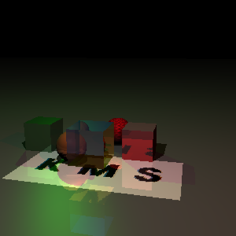
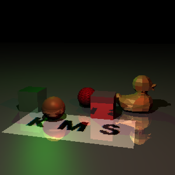
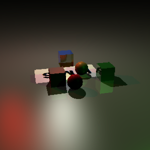
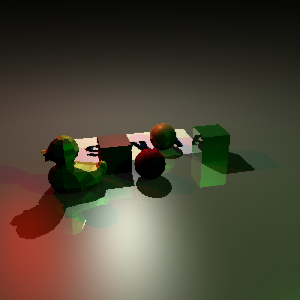

# Simple Python RayTracer 
## Overview
generate 3D renderings of scenes using the principles of ray tracing. 
- Ray tracing of spheres and polygons
- Recursive reflection to simulate the reflection of light off of surfaces
- Recursive refraction to simulate the bending of light as it passes through transparent objects
- Phong illumination
- Texture mapping for spheres and polygons

## Results

### Requirements
- numpy
- opencv-python